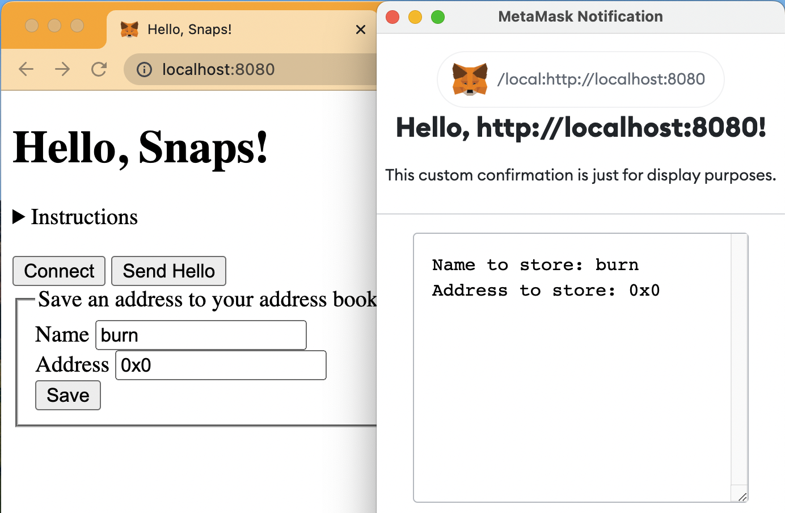
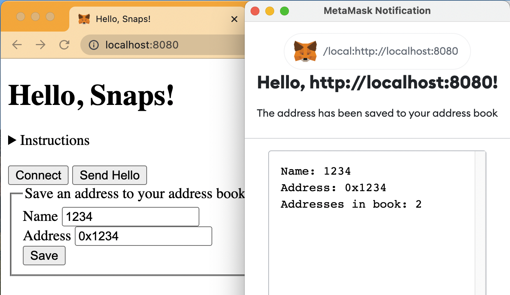
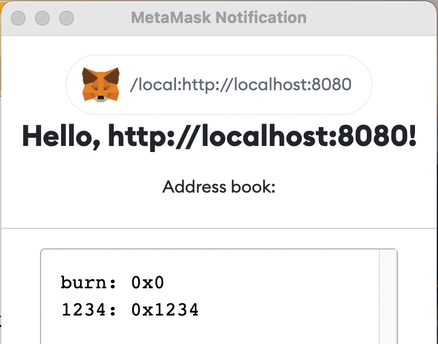

# @Montoya/address-book-snap-tutorial

A Snap example based on [@MetaMask/template-snap](https://github.com/MetaMask/template-snap). Read below for a tutorial!

## Prerequisites

Before you begin, make sure you have the following installed: 

* [Google Chrome](https://www.google.com/chrome/) 
* [MetaMask Flask](https://metamask.io/flask/)\* 
* [Node.js](https://nodejs.org/) 
* [Yarn](https://yarnpkg.com/)
* A text editor or IDE like [Visual Studio Code](https://code.visualstudio.com/)
* Optionally, a [GitHub account](https://github.com/) and a git client like [GitHub Desktop](https://desktop.github.com/)

\* *Please note: MetaMask Flask is experimental preview software. Please do not use your existing secret recovery phrase or keys with Flask. It is recommended that you create a new SRP for testing with Flask.*

## The 30-Minute Snap Tutorial

In this tutorial, you will learn how to manage state in a Snap and how to present a custom API for Dapps. The Snap you will implement is not meant to be an ideal way to manage an address book but rather to demonstrate some features to get you started building with Snaps. 

_If you have not done so already, you should follow the [5-Minute Snap Tutorial](https://github.com/Montoya/gas-fee-snap#the-5-minute-snap-tutorial) before starting with this tutorial._

First, navigate to the [@MetaMask/template-snap](https://github.com/MetaMask/template-snap) repository and click "Use this template." Give your new Snap a name, like `address-book-snap`. Clone the respository to your local machine. Open a command line tool and run `./scripts/cleanup.sh` to remove some MetaMask-specific files that will not work outside of the MetaMask GitHub organization. Now you are ready to start modifying the files in your Snap.

### Adding the Manage State Permission to your Snap

Open `snap.manifest.json`. This file has the main configuration details for your Snap. To enable your Snap to store an address book, you need to request the "manage state" permission. You can do this by modifying `initialPermissions` to include this permission, like so: 

```JSON
"initialPermissions": {
  "snap_confirm": {},
  "snap_manageState": {}
},
```

This will enable the use of the `snap_manageState` RPC method. With this method, you can save and retrieve data in your Snap.

### Storing Addresses 

Open `index.html`. This is the test Dapp that is included in the Snaps template. Add a form before the closing `</body>` tag that can be used to store an address and label, like so: 

```HTML
  <button class="connect">Connect</button>
  <button class="sendHello">Send Hello</button>

  <form id="storeAddress">
    <fieldset>
      <legend>Save an address to your address book</legend>
      <label for="nameToStore">Name</label>
      <input type="text" id="nameToStore" name="nameToStore"><br>
      <label for="addressToStore">Address</label> 
      <input type="text" id="addressToStore" name="addressToStore"><br>
      <input type="submit" id="storeAddress" value="Save">
    </fieldset>
  </form>
</body>
```

Next, add some Javascript before the closing `</script>` tag to capture the form input and pass that info to the Snap: 

```Javascript
const storeAddressForm = document.getElementById('storeAddress')
storeAddressForm.addEventListener('submit', storeAddress)

async function storeAddress (e) {
   e.preventDefault() // to prevent default form behavior 

   const name = document.getElementById('nameToStore').value
   const address = document.getElementById('addressToStore').value

   try { 
      const response = await ethereum.request({
         method: 'wallet_invokeSnap', 
         params: [snapId, {
           method: 'storeAddress',
           nameToStore: name, 
           addressToStore: address
         }]
      })
   } catch (err) { 
      console.error(err)
      alert('Problem happened: ' + err.message || err)
   }
}
</script>
```

Finally, add a case to `src/index.js` to handle receiving this request: 

```Javascript
wallet.registerRpcMessageHandler(async (originString, requestObject) => {
  switch (requestObject.method) {
    case 'storeAddress': 
      return wallet.request({
        method: 'snap_confirm', 
        params: [
          {
            prompt: `Hello, ${originString}!`, 
            description: 
              'This custom confirmation is just for display purposes.',
            textAreaContent: 
              `Name to store: ${requestObject.nameToStore}\n`+
              `Address to store: ${requestObject.addressToStore}`, 
          }, 
        ], 
      }); 
    case 'hello':
```

This is just like the `hello` case, but instead it displays the input name and address. Note the backticks \`\` used instead of apostrophes '' for strings that contain variable references. Also, note that `requestObject` is the object passed to the Snap with the method name and any optional parameters you include. 

Once you have made these changes, you can run the following commands on the command line to build and test your Snap: 

```Shell
yarn install

yarn build

yarn run serve
```

Open the dapp in Google Chrome and click "Connect" to connect and install the Snap, then enter a name and address in the form and click "Save." You should see a confirmation window like the following: 



This is great, but the goal is not to just show the inputs. The goal is to store them! Let's solve that in the next section. 

### Actually Storing Addresses

First, initialize the Snap's state with an empty address book. Add the following code in `src/index.js`: 

```Javascript
wallet.registerRpcMessageHandler(async (originString, requestObject) => {

  const state = await wallet.request({
    method: 'snap_manageState',
    params: ['get'],
  });

  if (!state) {
    state = {book:[]}; 
    // initialize state if empty and set default data
    await wallet.request({
      method: 'snap_manageState',
      params: ['update', state],
    });
  }

  switch (requestObject.method) {
```

This code retrieves the current data stored in the Snap's state, and if that data is not set, initalizes it with an object containing an empty array for the address book: `{book:[]}`. Note that `await` is used because these `wallet.request` calls are normally asynchronous but they need to be executed synchronously here. 

Next, add some code to store the name and address from the form before displaying the confirmation window: 

```Javascript
switch (requestObject.method) {
  case 'storeAddress': 
    state.book.push({
      name:requestObject.nameToStore,
      address:requestObject.addressToStore
    });
    await wallet.request({
      method: 'snap_manageState', 
      params: ['update', state], 
    }); 
    return wallet.request({
      method: 'snap_confirm', 
```

This code adds the new name and address to the end of the address book, and then updates the wallet state. 

Finally, display the result of this request in the confirmation window: 

```Javascript
  return wallet.request({
    method: 'snap_confirm', 
    params: [
      {
        prompt: `Hello, ${originString}!`, 
        description: 
          'The address has been saved to your address book',
        textAreaContent: 
          `Name: ${requestObject.nameToStore}\n`+
          `Address: ${requestObject.addressToStore}\n`+
          `Addresses in book: ${state.book.length}`,  
      }, 
    ], 
  }); 
case 'hello':
```

Build and run your Snap again, reload the companion Dapp, and follow the same steps to add an address. You should see a result like this: 


You can continue adding addresses and clicking Save, and the number of addresses will increase each time, like so: 



So far, so good! The next step is to try retrieving this data and using it. 

### Getting Stored Addresses

The simplest way to view the stored addresses is to output the array in another confirmation window. Update the `hello` case to do this: 

```Javascript
case 'hello':
  let address_book = state.book.map(function(item){
      return `${item.name}: ${item.address}`; 
    }).join("\n"); 
  return wallet.request({
    method: 'snap_confirm',
    params: [
      {
        prompt: `Hello, ${originString}!`,
        description: 'Address book:',
        textAreaContent: address_book,
      },
    ],
  });
default:
```

This code does a quick string conversion of the address book object (`map` each object in the array, then `join` the array) and outputs that in the `textAreaContent` field of the confirmation window. Build the Snap, connect to the Dapp, and click the "Send Hello" button to see the result: 



Note that you do not need to add addresses to the address book again before showing the addresses that are stored. The data in the wallet state is persisted even after updating the Snap! It is fetched from persistent storage with this code which you added earlier in this tutorial: 

```Javascript
const state = await wallet.request({
  method: 'snap_manageState',
  params: ['get'],
});
```

As the Snap developer, you are responsible for managing this data &mdash; it's up to you to decide when to update it or clear it. 

So now you have everything you need to store and retrieve data in a Snap! Read on to learn how to make this Snap a bit more useful. 